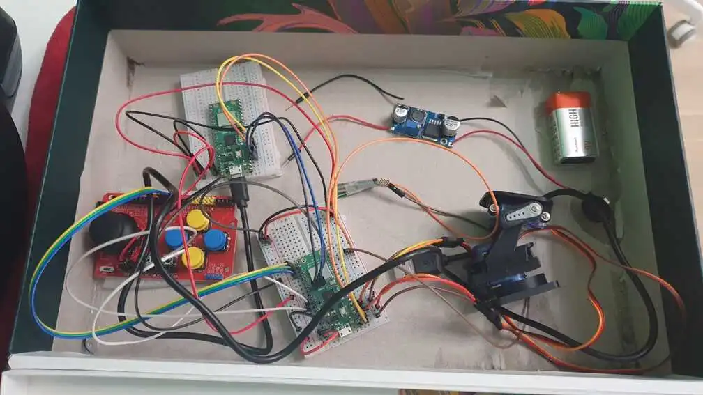
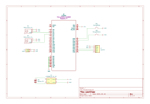

# LaserChase
A smart cat laser toy with manual or automatic movement patterns.

:::info 

**Author**: Ghiță Alexandru \
**GitHub Project Link**: [GitHub](https://github.com/UPB-PMRust-Students/proiect-Ghitzarino)

:::

## Description

LaserChase is a smart, interactive laser toy for cats, powered by a Raspberry Pi Pico 2W. The laser is mounted on two servo motors that allow it to move across two axes, with the capability to be turned on and off by pressing the joystick. It can operate in automatic mode - following random or pre-programmed motion patterns - or in manual mode, controlled by the joystick. Mode and pattern switching is done via button presses, making the experience more dynamic and engaging. The goal is to mimic the unpredictable movement of real prey, keeping your cat entertained and active.

## Motivation

I wanted to create something practical and enjoyable for use at home. As a cat owner, I thought this project would be a perfect blend of utility and fun-bringing joy to my pet while allowing me to experiment with hardware and software in an engaging way. Building LaserChase has given me the opportunity to explore electronics, real-time control, and embedded programming, all while making my cat happy.

## Architecture


The main software components of the project include:
- **Control Module**: Handles manual input from a joystick (ADC) and button presses (GPIO) to switch modes and patterns.
- **Mode Manager**: Keeps track of the current operating mode and interprets input accordingly.
- **Movement Generator**: Generates movement signals, either random/predetermined (automatic mode) or transformed from joystick input (manual mode).
- **Servo Driver**: Sends PWM signals to the two servo motors inside the 2-axis 3D printed stand to move the laser pointer mounted on top of it.

These components interact as follows:

- Input (buttons/joystick) -> Control Module -> Mode Manager -> Movement Generator -> Servo Driver -> Laser

## Log

<!-- write your progress here every week -->

### Week 5 - 11 May

Find out what how to connect and get input from buttons and joystick and how to power the laser and move the servo motors using the labs as example.
Get the rest of the needed components and a new pico 2w as a debug probe for easier programming.

### Week 12 - 18 May

Complete the schematic with a better understanding of how it should look like. Connect all of the harware components together and make sure they work.
Add a picture of the hardware in current form. Play around with the code to start things up for the software part.

### Week 19 - 25 May
TBD

## Hardware

- **Raspberry Pi Pico 2W**: LaserChase uses a Raspberry Pi Pico 2W as the main controller.
- **SG90 Servo (x2) + Laser Pointer**: Two SG90 servos are used to move the laser pointer on two axes.
- **Joystick Shield**: Control is done via a joystick shield and mode and pattern switching through push buttons.
- **9V Battery + Holder + DC-DC Step Down Module**: Power is supplied through a 9V battery regulated by a step-down module to 5V.
- **Breadboard + Wires**: Components are connected using wires and a breadboard.

### Hardware progress



### Schematics



### Bill of Materials

<!-- Fill out this table with all the hardware components that you might need.

The format is 
```
| [Device](link://to/device) | This is used ... | [price](link://to/store) |

```

-->

| Device | Usage | Price |
|--------|--------|-------|
| [2x Raspberry Pi Pico 2W](https://www.raspberrypi.com/documentation/microcontrollers/raspberry-pi-pico.html) | Main microcontroller + debug probe | [80 RON](https://www.optimusdigital.ro/en/raspberry-pi-boards/13327-raspberry-pi-pico-2-w.html) |
| [2x SG90 Servo Motors](https://docs.m5stack.com/en/accessory/sg90_servo?ref=langship) | Control the X/Y angle of the laser | [24 RON](https://www.optimusdigital.ro/en/servomotors/2261-micro-servo-motor-sg90-180.html) |
| [Joystick Shield V1.A](https://handsontec.com/dataspecs/module/Arduino%20Shield/Joystick%20Shield.pdf) | Manual control of laser | [20 RON](https://www.optimusdigital.ro/en/arduino-shields/1283-shield-joystick-pentru-arduino.html) |
| [DC-DC Step Down Module](https://www.st.com/en/power-management/dc-dc-converter-modules/documentation.html) | Voltage regulation to 5V | [13 RON](https://www.optimusdigital.ro/en/adjustable-step-down-power-supplies/1108-lm2596hv-dc-dc-step-down-module.html) |
| 9V Battery + Holder | Power source | [10.3 RON](https://www.optimusdigital.ro/en/battery-holders/20-9v-battery-support.html) |
| 2x Breadboard | Circuit connection | [9 RON](https://www.optimusdigital.ro/en/breadboards/44-400p-hq-breadboard.html) |
| Wires | Connections between components | [8 RON](https://www.optimusdigital.ro/en/wires-with-connectors/890-set-fire-tata-tata-40p-30-cm.html) |
| Micro USB Cable | Power and programming cable | [4 RON](https://www.optimusdigital.ro/en/usb-cables/11939-micro-usb-black-cable-1-m.html) |
| 2x Header Pins | Connection to breadboard | [4 RON](https://www.optimusdigital.ro/en/pin-headers/85-40p-254-mm-pin-header-200-pcs.html) |
| Laser Pointer | Red colored laser | [2.6 RON](https://www.emag.ro/jucarie-laser-pentru-pisici-rosu-las02/pd/D6MMH5MBM/?ref=graph_profiled_similar_fallback_1_3&provider=rec&recid=rec_49_02188673a55cfa40086dd06e58c266684d055622826af4a5d7d376fa854708ce_1745921180&scenario_ID=49) |
| TOTAL | --- | 174.9 RON |

## Software

| Library | Description | Usage |
|---------|-------------|-------|
| [embassy](https://github.com/embassy-rs/embassy) | Embassy | An asynchronous executor and Hardware Abstraction Layer (HAL) designed for constructing embedded applications in Rust |
| [embassy-executor](https://docs.embassy.dev/embassy-executor/git/std/index.html)| Embassy Executor | Used for task scheduling and asynchronous programming |
|[embassy-rp](https://docs.embassy.dev/embassy-rp/git/rp2040/index.html)| Embassy RP | Used for initializing and interacting with peripherals |
|[gpio](https://docs.embassy.dev/embassy-stm32/git/stm32c011d6/gpio/index.html)| GPIO | Used for interacting with GPIO pins |
| [rand](https://docs.rs/rand/latest/rand/) | Random number generation | For automatic/random movement logic |

## Links

<!-- Add a few links that inspired you and that you think you will use for your project -->

1. [Similar project](https://learn.adafruit.com/raspberry-pi-wifi-controlled-cat-laser-toy/overview)
2. [Controlling SG90 with PWM in Rust](https://blog.theembeddedrustacean.com/esp32-standard-library-embedded-rust-pwm-servo-motor-sweep)
3. [SG90 2-axis 3D print design](https://www.thingiverse.com/thing:2892903)
