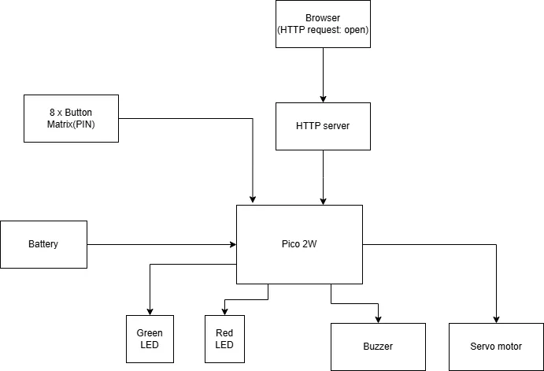
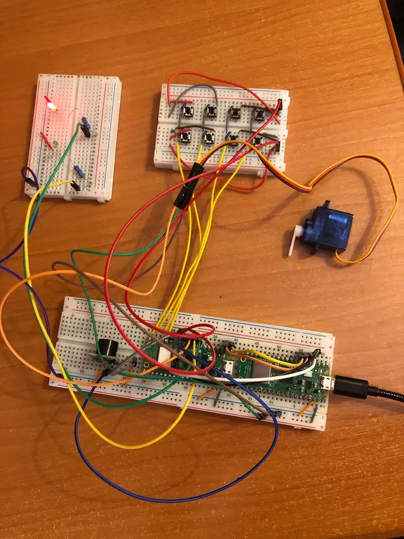
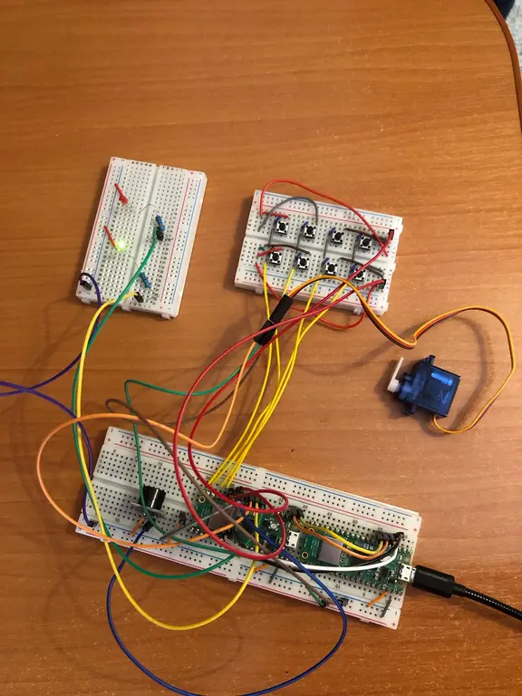
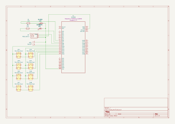

# SmartDoorGuard

A Smart Door Security System using Raspberry Pi Pico.

:::info 

**Author**: Dragos-Florin Fromea \
**GitHub Project Link**: [link](https://github.com/UPB-PMRust-Students/proiect-DragosFromea)

:::

## Description
The system allows authorized users to unlock a door either by entering a PIN on a custom keypad or by using a smartphone-based control. When a correct PIN is entered, the door unlocks and a green LED lights up to indicate successful access, while the red LED remains off. At all other times, the red LED stays on to indicate that the system is locked. If an incorrect PIN is entered, a buzzer emits a warning sound to alert the user of the failed attempt. The system enhances home or office security by providing both visual (LEDs) and auditory (buzzer) feedback.

## Motivation
One day, I saw an interesting door locking system at a friend's place. It had the option to unlock the door via a smartphone. I found the idea fascinating and decided to try building a similar system myself. This project gave me the opportunity to explore embedded hardware and learn how to implement secure access control using Rust.

## Architecture

The Raspberry Pi Pico reads button inputs, processes the PIN, and controls the servo, LEDs, and buzzer accordingly. All components are connected via GPIO pins. Additionally, the system supports door unlocking via smartphone communication over Wi-Fi by hosting a simple HTTP server, allowing authorized users to bypass PIN entry.

The system behavior changes depending on whether the door is locked or unlocked, a correct PIN has been entered, or an unlock signal has been received from the smartphone.

If an incorrect PIN is entered, the Pico sends a signal to turn on the red LED and activate the buzzer to indicate an invalid access attempt.

If the correct PIN is entered or the unlock button is pressed on the HTTP web page, the Pico sends a signal to turn on the green LED and activates the servo motor to unlock the door.

## Log

<!-- write your progress here every week -->

### Week 5 - 11 May
I created documentation that includes how the components interact and how I planned the implementation from the beginning. I described the main idea of the project, and listed the hardware used. I also included details about the system logic.
### Week 12 - 18 May
I worked on the hardware part of the project, where I physically connected all the components and made sure everything worked as expected. I also created the circuit schematic using KiCad to have a clear and organized view of the connections.
### Week 19 - 25 May

## Hardware

The system uses the following components:

- Raspberry Pi Pico: acts as the central control unit
- 8 push buttons(2 x 4 matrix): used for entering the PIN
- Servo motor: used to physically lock and unlock the door
- Green LED: lights up when the door is successfully unlocked
- Red LED: lights up when the PIN is incorrect or the door remains locked
- Active buzzer: emits a warning sound when a wrong PIN is entered
- Power supply: external battery powering the system
- Breadboard and jumper wires: used for prototyping and connecting components

### Schematics

### Bill of Materials

| Device | Usage | Price |
|--------|-------|-------|
| [Raspberry Pi Pico 2W](https://datasheets.raspberrypi.com/picow/pico-2-w-datasheet.pdf) | The microcontroller | [79,32 RON](https://www.optimusdigital.ro/ro/placi-raspberry-pi/13327-raspberry-pi-pico-2-w.html?search_query=5056561803975&results=1) |
| [Micro Servomotor SG90 90°](http://www.ee.ic.ac.uk/pcheung/teaching/DE1_EE/stores/sg90_datasheet.pdf) | Controls door opening/closing mechanism | [13,99 RON](https://www.optimusdigital.ro/ro/motoare-servomotoare/26-micro-servomotor-sg90.html?search_query=0104110000001368&results=1) |
| [Green LED](https://www.farnell.com/datasheets/1498852.pdf) | Provides visual feedback for unlock | [0.39 RON](https://www.optimusdigital.ro/ro/optoelectronice-led-uri/697-led-verde-de-3-mm-cu-lentile-difuze.html?search_query=0104210000006209&results=1) |
| [RED LED](https://www.farnell.com/datasheets/1498852.pdf) | Provides visual feedback for lock | [0.39 RON](https://www.optimusdigital.ro/ro/optoelectronice-led-uri/696-led-rou-de-3-mm-cu-lentile-difuze.html?search_query=0104210000006186&results=1) |
| [Active Buzzer](https://www.electronicoscaldas.com/datasheet/LTE12-Series.pdf?srsltid=AfmBOoplfcUs8dHMx7_GHF5VZUkplYxPPDjeokx0V-s63vRyeFdarDPI) | Emits warning sound on wrong PIN entry | [4,98 RON](https://www.optimusdigital.ro/ro/optoelectronice-led-uri/697-led-verde-de-3-mm-cu-lentile-difuze.html?search_query=0104210000006209&results=1) |
| Breadboard Kit + jumpers | Used for prototyping and connecting components | [22 RON](https://www.optimusdigital.ro/ro/kituri/2222-kit-breadboard-hq-830-p.html?search_query=Kit+Breadboard+HQ830+cu+Fire+%C8%99i+Sursa&results=1) |
| Buttons 6x6x6 | Used for entering PIN digits | [2,88 RON](https://www.optimusdigital.ro/ro/butoane-i-comutatoare/1119-buton-6x6x6.html?search_query=0104210000010862&results=1) |
| Resistences | Used for current limiting in LEDs and button debouncing | [~2 RON](https://www.optimusdigital.ro/ro/componente-electronice-rezistoare/848-rezistor-025w-22k.html?search_query=0104210000007374&results=1) |
| Micro USB Cable 1 m | Used to power the Raspberry Pi Pico 2W | [3.99 RON](https://www.optimusdigital.ro/ro/cabluri-cabluri-usb/11939-cablu-negru-micro-usb-1-m.html?search_query=0104210000077995&results=1) |
| 2x8 Pin Female Header | Used to connect Raspberry Pi Pico to breadboard | [1.98 RON](https://www.optimusdigital.ro/ro/componente-electronice-headere-de-pini/4209-header-de-pini-mama-2x8p-254-mm.html?search_query=0104210000035148&results=1) |

### Software

| Library         | Description                                    | Usage                          |
|----------------|------------------------------------------------|--------------------------------|
| [embassy-executor](https://crates.io/crates/embassy-executor) | Asynchronous executor for embedded Rust | Running tasks asynchronously |
| [embassy-rp](https://crates.io/crates/embassy-rp)             | Embassy support for Raspberry Pi Pico W | Access peripherals          |
| [embassy-time](https://crates.io/crates/embassy-time)         | Timer driver and time utilities         | Delays, alarms, and timekeeping |
| [embassy-sync](https://crates.io/crates/embassy-sync)         | Async channels, signals, and mutexes    | Communication between tasks |
| [cyw43](https://crates.io/crates/cyw43)                       | Wi-Fi driver for CYW43439 chip          | Wi-Fi connectivity          |
| [embassy-net](https://crates.io/crates/embassy-net)           | Asynchronous embedded TCP/IP stack      | HTTP over TCP               |
| [defmt](https://crates.io/crates/defmt)                       | Efficient logging framework for embedded devices | Debug print messages |
| [static_cell](https://crates.io/crates/static_cell)           | Safe statics for no_std environments    | Static allocation           |

## Links
1. [Door lock](https://www.youtube.com/watch?v=kGyQS3B1IwU&t=19s)