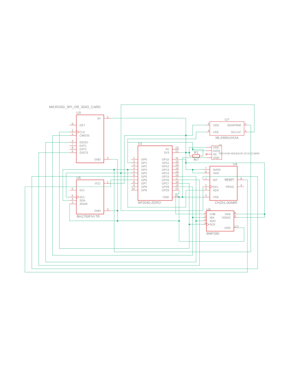
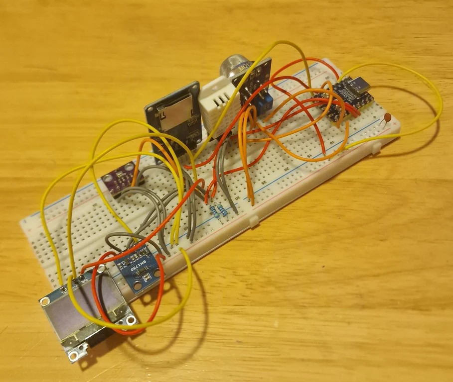

# Rust-Embedded Weather Station

:::info

**Author:** Tusca Mircea \
**GitHub Project Link**: [Weather Station](https://github.com/UPB-PMRust-Students/proiect-mtusca)

:::

---

## 1. Functional Description
The Rust-Embedded Weather Station is a compact, battery-powered device built on the RP2040 microcontroller that continuously monitors key environmental parameters. It reads:

- **Temperature & Humidity** via a DHT22 sensor  
- **Atmospheric Pressure** via a BMP280 sensor  
- **Ambient Light Level** via a BH1750 sensor  
- **Air Quality** (volatile compounds proxy) via an MQ-135 gas sensor  

All sensor data are acquired asynchronously using the Embassy framework, processed on-board, and displayed in real time on a 0.96″ SSD1306 OLED screen.

## 2. Motivation
The motivation for this project was the desire to create a device that would be useful in daily life and that will operate with a lot of data,
giving the posibility of exploring how different sensors work with each other and how the data could be managed and used inside the software.

## 3. System Architecture
The overall system is organized into three main subsystems—**Sensing**, **Processing**, and **Output**—all coordinated by the RP2040 microcontroller running Rust/Embassy firmware.

### Subsystems

- **Sensing Subsystem**  
  - **DHT22** (temperature & humidity): single-wire digital interface  
  - **BMP280** (pressure): I²C bus  
  - **BH1750** (light): I²C bus  
  - **MQ-135** (air quality): analog voltage via ADC  

- **Processing Subsystem (RP2040 + Embassy)**  
  - **Async executor**  
  - **Sensor-reader tasks** (one per sensor), each sampling on its own schedule  
  - **Inter-task channels** (`embassy_sync::channel`) to serialize and buffer readings  
  - **Data formatting** (convert raw counts/voltages into human-readable units)  

The HC-06 is a serial-port-profile (SPP) Bluetooth 2.0 module that acts as a wireless UART slave. It’s ideal for streaming sensor data to a phone or PC:

- **Supply voltage:** 3.3 V–6 V (power from the USB 5 V rail is fine)  
- **Logic level:** 3.3 V on TX/RX  
- **Default baud rate:** 9600 bps (configurable via AT commands)  
- **Pins:**  
  - VCC → 5 V (USB)  
  - GND → GND  
  - TX → RP2040 RX  
  - RX → RP2040 TX 

---

### microSD SPI Module

This breakout makes adding removable flash storage trivial via the RP2040’s SPI peripheral:

- **Interface:** SPI (CS, SCK, MOSI, MISO)  
- **Supply & level shifting:**  
  - VCC accepts 5 V (on-board regulator → 3.3 V)  
  - Logic-level shifters on data lines  
- **Supported cards:** microSD / SDHC up to 32 GB (Class 10 recommended)  
- **Pins:**  
  - GND → GND  
  - VCC → 5 V (USB)  
  - CS  → any free GPIO  
  - SCK → SPI0_SCK   
  - MOSI → SPI0_MOSI  
  - MISO → SPI0_MISO 

- **Output Subsystem**  
  - **SSD1306 OLED**: I²C display task subscribes to the channel of aggregated reading

### Data Flow

1. **Sensor sampling**  
   - Each sensor-task wakes on a timer, performs its read (I²C transaction or ADC conversion), then packages a measurement struct.

2. **Channel exchange**  
   - Measurement structs are sent into a bounded Embassy channel, decoupling sampling rate from display refresh.

3. **Aggregation & formatting**  
   - A dedicated “display” task collects the latest value from each sensor channel, formats strings (“T=23.5 °C”, “RH=45 %”, etc.).

4. **Display update**  
   - The display task issues I²C write sequences to the SSD1306, refreshing the on-screen dashboard at a fixed interval (e.g. 1 Hz).

## 4 Hardware Components

- **RP2040-Zero**: Dual-core ARM Cortex-M0+ microcontroller running the Rust/Embassy firmware; orchestrates sensor reads, data processing, and I/O.  
- **DHT22 (AM2302)**: Single-wire digital sensor for temperature (±0.5 °C) and humidity (±2 % RH), updates every ≥2 s.  
- **BMP280**: I²C barometric pressure and temperature sensor; provides high-resolution pressure (Pa) and temperature (°C) readings.  
- **BH1750**: I²C ambient light sensor; measures illuminance in lux for display and adaptive logic.  
- **MQ-135**: Analog gas sensor; outputs voltage via ADC proportional to air-quality (volatile compounds proxy).  
- **SSD1306 OLED (0.96″)**: I²C monochrome display; renders real-time text/graphics of sensor values at ~1 Hz.  
- **microSD SPI Module**: SPI flash storage breakout; logs timestamped CSV sensor data to a microSD card.  
- **HC-06 Bluetooth Module**: UART SPP slave device; streams ASCII-formatted sensor readings over Bluetooth at a default 9600 bps.  

## Log
- **Week 5 - 11 May**:  
  Documentation implemented
- **Week 12 - 18 May**:  
  Added schematic and hardware photo of the project
- **Week 19 - 25 May**:  
  Hardware presentation, final adjustments, working on the software part

## Schematics

## Photo

## Bill of Materials

| Device                                               | Usage                                 | Price                                                                                                  |
| :--------------------------------------------------- | :------------------------------------ | :----------------------------------------------------------------------------------------------------  |
| RP2040-Zero development board                        | Main MCU                              | [7.88 €](https://sigmanortec.ro/en/development-board-with-raspberry-rp2040-cortex-m0-2mb-flash)        |
| DHT22 AM2302 sensor                                  | Temperature & humidity measurement    | [8.54 €](https://sigmanortec.ro/en/temperature-and-humidity-sensor-dht22-am2302-original-module)       |
| BMP280 pressure/temperature sensor                   | Barometric pressure & temperature     | [2.01 €](https://sigmanortec.ro/it/sensore-bmp280-pressione-atmosferica-temperatura-33-v)              |
| BH1750 GY-302 light sensor                           | Ambient illuminance measurement       | [10.40 €](https://www.sigmanortec.ro/en/light-intensity-sensor-gy-302-bh1750)                          |
| MQ-135 air-quality sensor                            | Analog proxy for air pollution        | [2.73 €](https://sigmanortec.ro/en/sensore-di-qualita-aria-mq-135)                                     |
| 0.96″ SSD1306 OLED display                           | I²C visual interface for readings     | [4.10 €](https://sigmanortec.ro/it/display-oled-096-i2c-iic-bianco)                                    |
| MicroSD SPI Data Logger module                       | Logs CSV data to microSD via SPI      | [4.08 €](https://sigmanortec.ro/en/microsd-module)                                                     |
| Patriot microSDHC 16 GB, Class 10                    | Storage medium for logged data        | [18.80 Lei](https://www.emag.ro/card-microsd-patriot-16-gb-clasa-10-psf16gmdc10/pd/DRQQHXMBM/)         |
| HC-06 Bluetooth module                               | Streams data over UART → Bluetooth    | [6.88 €](https://www.sigmanortec.ro/en/bluetooth-module-hc-06)                                         | 

## Software

| Crate / Library                                                             | Description                             | Usage in Project                                         |
| :-------------------------------------------------------------------------- | :-------------------------------------- | :------------------------------------------------------- |
| [embassy](https://embassy.dev/)                                             | Asynchronous embedded framework         | Core async executor and timer scheduling                 |
| [embassy-rp](https://crates.io/crates/embassy-rp)                           | RP2040 Hardware Abstraction Layer (HAL) | GPIO, I²C, SPI, ADC drivers for the RP2040               |
| [embedded-hal](https://github.com/rust-embedded/embedded-hal)               | HAL traits                              | Unified hardware driver interfaces                       |
| [dht-sensor](https://crates.io/crates/dht-sensor)                           | DHT22 driver                            | Reads temperature & humidity from the DHT22              |
| [bmp280-ehal](https://crates.io/crates/bmp280-ehal)                         | BMP280 driver                           | Interfaces with the BMP280 over I²C                      |
| [bh1750](https://crates.io/crates/bh1750)                                   | BH1750 driver                           | Interfaces with the BH1750 light sensor                  |
| [ssd1306](https://crates.io/crates/ssd1306)                                 | SSD1306 OLED driver                     | Controls text/graphics on the 0.96″ I²C OLED             |
| [embedded-graphics](https://github.com/embedded-graphics/embedded-graphics) | 2D graphics library                     | Renders fonts and simple graphics on the OLED            |
| [embedded-sdmmc](https://github.com/rust-embedded-community/embedded-sdmmc) | FAT filesystem support for SD cards     | Manages file I/O (CSV logs) on the microSD card          |
| [heapless](https://crates.io/crates/heapless)                               | No-std data structures                  | Buffers sensor data and display frames without allocator |
