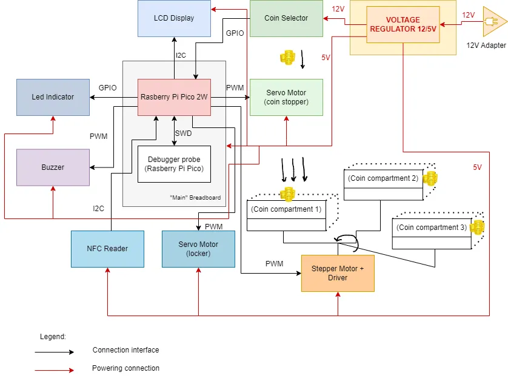
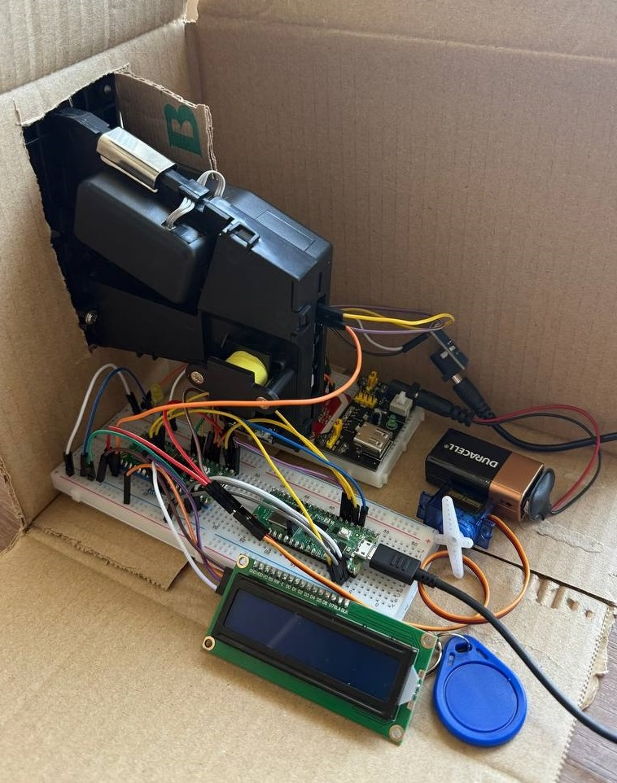
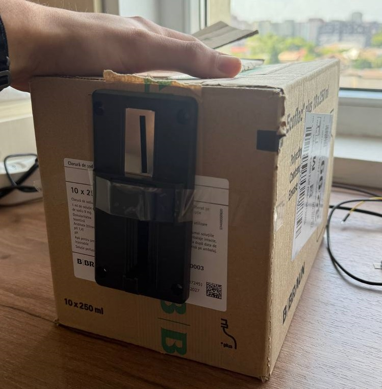
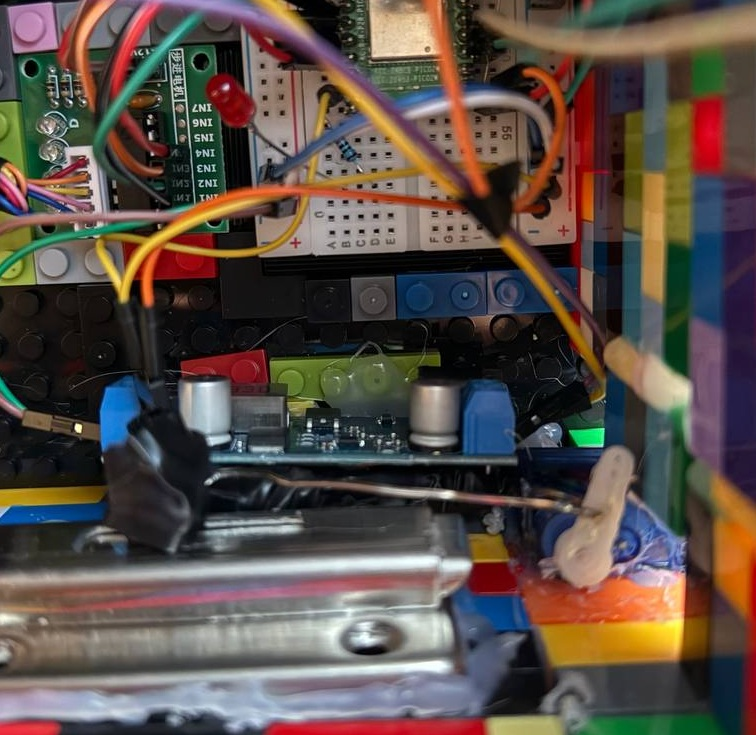
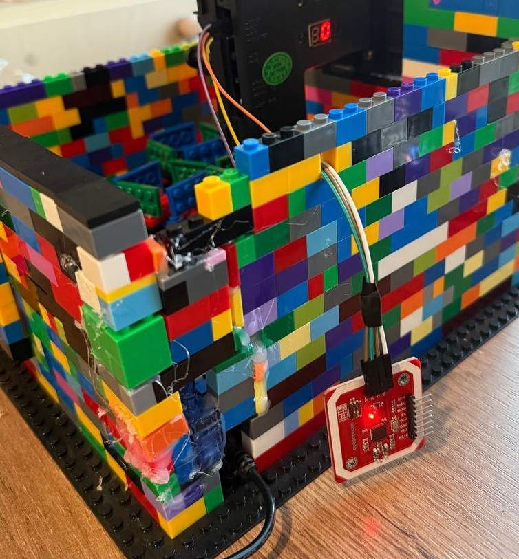
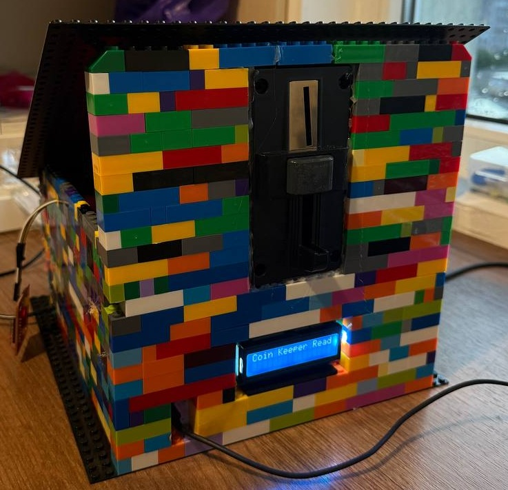
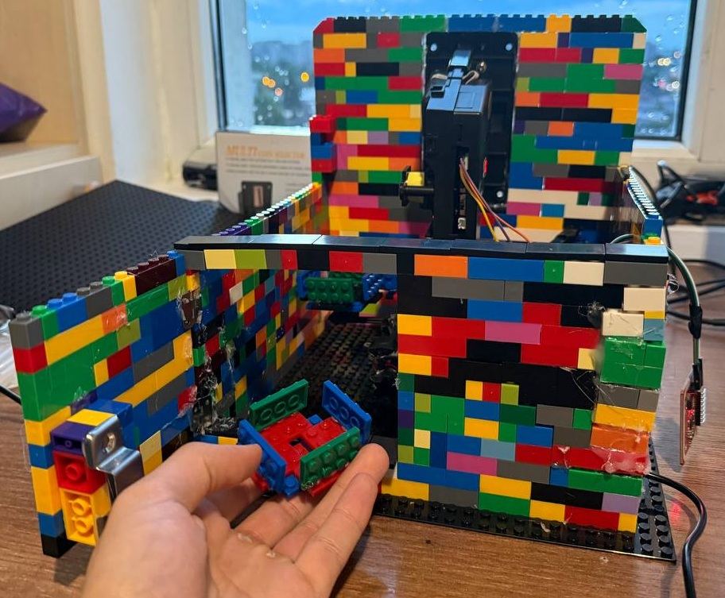
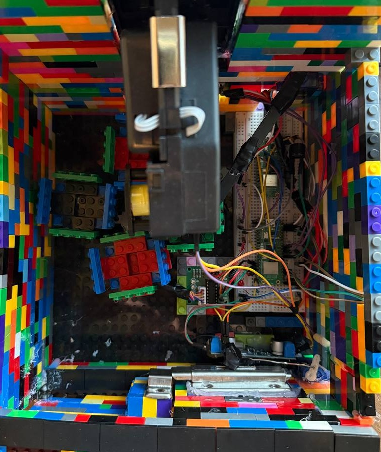
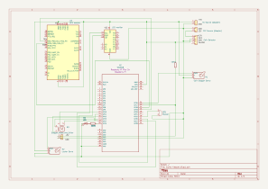

# Coins Keeper
*A coin-sorting-counting device that automatically identifies and sorts coins into designated compartments for their safely storing*

:::info

**Author**: Vladyslav Kiselar \
**GitHub Project Link**: [GitHub](https://github.com/UPB-PMRust-Students/project-vlladislavii)

::::
## Description

Coins Keeper is an automated coin-sorting device that identifies the denomination of each coin inserted and sorts them into designated compartments. When a coin is inserted, it passes through a coin selector module which determines the coin’s value. A stepper-motor-driven mechanism then rotates to align the correct storage box under the coin so that it falls into the appropriate bin. The digital display shows the current total balance in real time, and a buzzer provides an audible beep whenever a coin is accepted, giving immediate feedback to the user.

In addition to sorting, Coins Keeper includes a security feature to protect the collected coins. An NFC reader module allows an authorized user to unlock the coin compartment by scanning an NFC card or tag. This ensures that only authorized users can retrieve the coins.

## Motivation
The idea behind Coins Keeper came from a practical and relatable problem: managing and organizing loose change. Coins often accumulate in drawers, pockets, or jars without any clear order, making them inconvenient to use or store efficiently. I wanted to design a device that not only solved this everyday issue but also allowed me to apply embedded systems and automation in a tangible, functional way.

By building an automatic coin sorter with security features like NFC access, I’m integrating mechanical design, microcontroller programming, and real-time interaction — all essential skills in embedded development.

Choosing this project also allows for creative freedom in problem-solving — from designing a sorting mechanism to managing user feedback and storage access.

## Architecture

The system architecture is illustrated in the block diagram below. When a coin is inserted, it first passes through the coin selector module, which identifies the coin’s denomination. The module sends a signal to the Raspberry Pi Pico 2W microcontroller, which actuates a stepper motor (through a motor driver) to rotate the sorting mechanism and direct the coin into the correct storage box.

To ensure the coin doesn’t fall before the sorting platform is correctly positioned, a servo motor is used as a stopper. It holds the coin briefly after detection, then releases it once the correct bin is ready beneath. This ensures accurate sorting even with mechanical delays.

Once the coin is successfully deposited, the display is updated to show the current coin balance, and a buzzer sounds as confirmation.

For collecting the stored coins, the system integrates a locking mechanism. A metal latch is mechanically actuated by a servo motor. This acts as an electronically controlled lock. To unlock the compartment, the user must authenticate using an NFC module. If the scanned card/tag is authorized, the servo moves the latch to allow access.

  

## Log

### Week 5 - 11 May

After receiving approval for the project, I gathered all the essential components and began working on the hardware setup. This included connecting the coin selector, servo motors, LCD, Raspberry Pi Pico 2W, and other peripherals, all mounted on a temporary prototype base.

At this stage, I assembled the core electronics on a breadboard for testing and integration. The prototype is currently built inside a simple cardboard mock-up, serving as a placeholder for component layout. This temporary enclosure helps visualize positioning and spacing. In the final version, LEGO bricks will be used to construct both the case and the coin compartments, with most components expected to be fixed using a hot glue gun.

 

Currently, there are no dedicated sorted compartments for coins. These will also be constructed from LEGO once the main structure stabilizes and all measurements are confirmed.

As of this week, the coin selector is powered via a DC jack module, while all other components run off a 9V battery. This setup is proving inefficient and unstable — the battery cannot consistently provide the required current for reliable operation.

 

Looking forward, the plan is to introduce a voltage regulator to supply both the coin selector and the remaining components from a single, centralized source. However, it's still unclear whether this configuration will be able to sustain the full system load under all conditions.

### Week 12 - 18 May

This week marked a significant step forward in finalizing the physical structure and improving power stability. I successfully introduced a voltage regulator module to convert 12V input down to 5V, which now supplies power to both the coin selector and all other components. This change eliminates the need for a separate 9V battery and has greatly improved system stability and reliability under continuous operation.

  

  

With the electronics now reliably powered, I moved on to constructing the final enclosure. The entire prototype has been rebuilt using LEGO bricks, replacing the earlier cardboard mock-up. This new “home” includes well-structured coin sorting boxes, each custom-built from LEGO to match the coin types and sorting paths.

  

Additionally, I installed a locking mechanism for the coin collection compartment using a servo-controlled door system. The enclosure also features cleanly cut access ports, allowing easy connection to a 12V power source and facilitating code uploads to the Raspberry Pi Pico via USB without disassembling the setup.

### Week 19 - 25 May

## Hardware

The control logic of Coins Keeper is implemented on Raspberry Pi Pico 2W boards. One Pico serves as the main controller,  which manages all coin detection, sorting, and feedback components, while a second Pico is optionally used as a debugging probe during development. Coins are inserted into a commercial coin selector, powered via a 12V DC jack. Upon detection, a servo motor acts as a stopper to briefly hold the coin while a stepper motor rotates the sorting platform to align the correct compartment underneath. The coin is then released into the bin.

A 16x2 I2C LCD displays the current balance and system messages, while a passive buzzer and status LED provide audio and visual feedback. An NFC reader module is integrated for access control. When an authorized NFC card or tag is scanned, the system activates a servo-driven physical latch to unlock the compartment — securing the coins from unauthorized access.

Most components are now permanently wired and installed inside a LEGO-built enclosure. All servos, stepper motors, and sensors are connected, and coin bins have been fully constructed from LEGO to match sorting paths. Parts are fixed in place using a hot glue gun for stability.

The system is now powered from a single 12V input through a voltage regulator that steps down to 5V, supplying all components including the coin selector. This setup has replaced the previous 9V battery and breadboard power module, and has proven to be more stable during ongoing system testing.

### Schematics

  

### Bill of Materials

| Device | Usage | Price |
|--------|--------|-------|
| [2 x Raspberry Pi Pico 2W](https://www.raspberrypi.com/documentation/microcontrollers/raspberry-pi-pico.html) | Microcontroller (2 units: main + debugging) | [79.32 RON](https://www.optimusdigital.ro/en/raspberry-pi-boards/12394-raspberry-pi-pico-w.html) |
| [Multi-coin selector module (626 model)](https://probots.co.in/technical_data/Probots616CoinAcceptorModuleDatasheet.pdf) | Detects and identifies coins | [165 RON](https://www.emag.ro/acceptor-monede-616-1463/pd/DXDZFRMBM/) |
| [Stepper motor (28BYJ-48 5VDC)](https://www.datasheetcafe.com/28byj-48-datasheet-5v-stepper-motor/) | Rotates mechanism to direct coins | [19.16 RON](https://www.emag.ro/motor-pas-cu-pas-angrenaj-5v-sistem-de-control-uln2003-multicolor-2-a-007/pd/DGD5NLMBM/) |
| [2 x Servo motor SG90 180°](http://www.ee.ic.ac.uk/pcheung/teaching/DE1_EE/stores/sg90_datasheet.pdf) | For "keeping" coin mechanism / locker mechanism | [23.98 RON](https://www.optimusdigital.ro/en/servomotors/2261-micro-servo-motor-sg90-180.html?gad_source=1&gad_campaignid=19615979487&gbraid=0AAAAADv-p3DST91rElLA-XfsBRapIVDc8&gclid=EAIaIQobChMI3a_E8rSHjQMV_4KDBx1AbxVoEAQYASABEgKduPD_BwE) |
| [16X2 LCD Display](https://www.vishay.com/docs/37484/lcd016n002bcfhet.pdf) | Displays coin balance and status | [16.34 RON](https://www.vishay.com/docs/37484/lcd016n002bcfhet.pdf) |
| [Passive Buzzer](https://product.tdk.com/en/system/files/dam/doc/product/sw_piezo/sw_piezo/piezo-buzzer/catalog/piezoelectronic_buzzer_ps_en.pdf) | Audio feedback for coin detection | [0.99 RON](https://www.optimusdigital.ro/en/buzzers/12247-3-v-or-33v-passive-buzzer.html?search_query=buzzer&results=87) |
| [NFC module (PN532)](https://www.elechouse.com/elechouse/images/product/PN532_module_V3/PN532_%20Manual_V3.pdf) | Secure access to stored coins | [33.19 RON](https://www.emag.ro/cititor-rfid-nfc-pn532-13-56-mhz-i2c-spi-card-si-breloc-42-x-42-mm-multicolor-2-m-058/pd/DN3XKLMBM/) |
| 12V Universal Power Supply Adapter | Adapter for powering coin selector | [15 RON](https://www.emag.ro/sursa-alimentare-universala-xtech-12-v-2-a-ac-negru-1055452582/pd/D847MWMBM/) |
| DC Socket Module | Socket for adapter for powering the coin selector | [4.99 RON](https://www.optimusdigital.ro/en/connectors/177-dc-socket-module.html) |
| Battery 9V (Duracell) | Voltage supply for most components | [15.14 RON](https://www.emag.ro/baterie-duracell-bsc-9v-dl-5000394077225/pd/DP5KQ3BBM/?cmpid=146119&utm_source=google&utm_medium=cpc&utm_content=82270117088&utm_campaign=(RO:Whoop!)_3P-Y_%3e_Aparate_foto_and_accesorii_order_test&gad_source=1&gbraid=0AAAAACvmxQhtLRNIPdiBQCKdqoLIqQFlF&gclid=EAIaIQobChMIp8yD7K6HjQMV1KKDBx1zfwulEAQYAiABEgIxSfD_BwE) |
| 9 V Battery Connector with DC Jack | Powering the breadboard using 9V battery| [1.49 RON](https://www.optimusdigital.ro/en/wires-with-connectors/896-9v-battery-connector-with-dc-jack.html?gad_source=1&gad_campaignid=19615979487&gbraid=0AAAAADv-p3DST91rElLA-XfsBRapIVDc8&gclid=EAIaIQobChMImrDgmbGHjQMViICDBx2QsDiZEAQYASABEgKEuPD_BwE)|
| [Low-Voltage Source Module](https://www.ti.com/lit/ds/symlink/tlvm23625.pdf) | For future using 12V adapter as single voltage supply for all components (instead of battery) | [24.99 RON](https://www.optimusdigital.ro/ro/surse-coboratoare/8401-modul-sursa-de-tensiune-coboratoare-6-a-intrare-9-36-v-ieire-5-v.html?srsltid=AfmBOor_MjVUrlZnqttY73JEdgAcJYqvx72AYVLDsM-dxcLz_eKeyaZS) |
| Breadboard Power Supply | For giving 3.3V/5V powering via battery | [4.69 RON](https://www.optimusdigital.ro/en/linear-regulators/61-breadboard-source-power.html?gad_source=1&gad_campaignid=19615979487&gbraid=0AAAAADv-p3DST91rElLA-XfsBRapIVDc8&gclid=EAIaIQobChMI9onavc2HjQMVe4-DBx1WZgqwEAQYASABEgIAivD_BwE) |
| Wiring and misc. | Jumper wires, breadboards, connectors | - |
| Custom coin compartments | Store sorted coins (LEGO) | - |

## Software

| Library | Description | Usage |
|--------|-------------|-------|
| [embassy-rp](https://docs.embassy.dev/embassy-rp/git/rp235xa/index.html) | HAL for Raspberry Pi Pico | Access to GPIO, I2C, PWM, and other peripherals |
| [embassy-executor](https://docs.embassy.dev/embassy-executor/git/cortex-m/index.html) | Embedded async/await runtime | Runs non-blocking async tasks |
| [embassy-time](https://docs.embassy.dev/embassy-time/git/default/index.html) | Timekeeping and timers | Used for debounce logic, delays, and timed feedback |
| [embassy-sync](https://docs.embassy.dev/embassy-sync/git/default/index.html) | Async-safe synchronization | Future inter-task communication (channels, mutexes) |
| [embassy-embedded-hal](https://docs.embassy.dev/embassy-embedded-hal/git/default/index.html) | HAL adapter for Embassy | Bridges Embassy drivers with `embedded-hal` traits |
| [embedded-hal](https://github.com/rust-embedded/embedded-hal) | Embedded Hardware Abstraction Layer | Unified interfaces for drivers (SPI, I2C, GPIO, etc.) |
| [hd44780-driver](https://github.com/JohnDoneth/hd44780-driver) | Driver for HD44780 LCD over I2C | Displays messages and coin balance |
| [heapless](https://github.com/japaric/heapless) | Fixed-size collections for no_std | String construction and buffer-safe operations |
| [fixed](https://docs.rs/fixed) | Fixed-point arithmetic | Used for PWM servo pulse calculations |
| [defmt](https://github.com/knurling-rs/defmt) | Lightweight logger for embedded systems | Real-time logging via RTT |
| [panic-probe](https://docs.rs/panic-probe) | Minimal panic handler with defmt support | Shows panic info in debug output |
| [pn532](https://crates.io/crates/pn532) | NFC reader driver | For secure card/tag authentication |
| [stepper](https://docs.rs/stepper) | Stepper motor driver | To control the rotating sorting mechanism |
| [embedded-hal-async](https://docs.rs/embedded-hal-async) | Async traits for embedded drivers | If future peripherals need async SPI/I2C access |

## Links

1. [How to use CH-926 Coin Acceptor](https://www.youtube.com/watch?v=sfE7yqtd8TA)
2. [Embedded Rust Book](https://docs.rust-embedded.org/book/)

